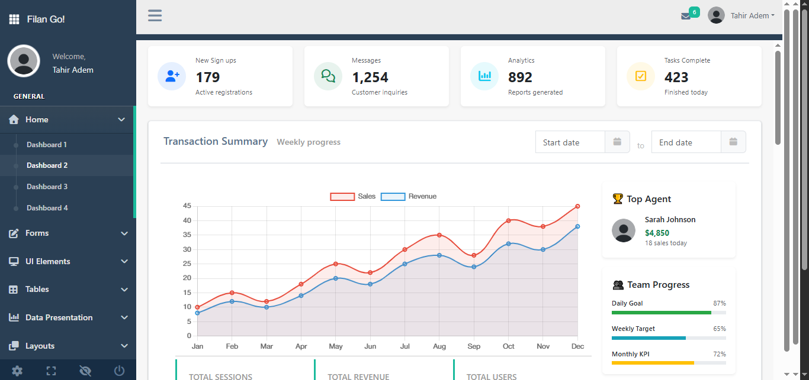

# 🌟 Filan Admin Dashboard

A modern, free Bootstrap 5 admin dashboard template — powered by Vite for blazing-fast performance.

Filan is a clean and responsive admin dashboard template designed for building dashboards, analytics apps, and admin panels. With Bootstrap 5, Vite, and modern JavaScript, it offers a sleek UI, professional components, and lightning-fast development workflow.



---

## ✨ Key Features

* ⚡ Vite Build System – Instant hot-reload & optimized production builds
* 🎨 Modern UI Kit – Bootstrap 5.3 with mobile-first design
* 📊 Charts & Graphs – Chart.js, ECharts, Sparklines, and jVectorMap
* 📱 Fully Responsive – Works on phones, tablets, desktops
* 🛠️ Custom Widgets – Dashboards, cards, forms, and tables
* 🚀 Performance Optimized – 90% smaller bundle with smart code splitting
* 🔒 Secure & Updated – Latest dependencies with CVE fixes
* 🌍 Community Integrations – Rails, Laravel, Django, Angular, React, and more

---

## 🚀 Quick Start

### Prerequisites

* Node.js (v16+)
* npm or yarn

### Installation

```bash
# Clone the repository
git clone https://github.com/puikinsh/Filan.git
cd Filan

# Install dependencies
npm install

# Start dev server
npm run dev

# Build for production
npm run build
```

---

## 📂 Project Structure

```
Filan/
├── production/      # HTML templates (42 pre-built pages)
├── src/             # Source files
│   ├── js/          # Custom JS (modernized, jQuery-free)
│   ├── scss/        # SASS modules & theme styles
│   ├── utils/       # DOM utilities
│   └── modules/     # Charts, forms, tables, dashboards
├── dist/            # Production build
├── vite.config.js   # Vite configuration
└── package.json     # Scripts & dependencies
```

---

## 📊 Available Components

### Dashboards

* Multiple layouts
* Interactive charts & maps
* Custom widgets

### Forms

* Multi-step wizards
* File upload with progress
* Validation & enhancements

### UI Elements

* DataTables with filtering & sorting
* Icons (Font Awesome 6)
* Media gallery with lightbox
* Calendar & events

### Pages

* E-commerce (product listings, cart)
* User management (profiles, contacts)
* Auth pages (login, register)
* Error pages (403, 404, 500)

---

## 🌍 Deployment

Build and deploy with a single command:

```bash
npm run build
```

* Netlify / Vercel – Deploy directly from GitHub
* GitHub Pages – Built-in support via GitHub Actions
* Any hosting – Upload `/dist` folder

---

## 📜 License

Licensed under MIT.
Free to use, modify, and distribute.
Attribution to [Colorlib](https://colorlib.com/) is required.

---

## 👥 Maintainers

* Colorlib – Original design & development
* Aigars Silkalns – Lead maintainer

---

## ❤️ Acknowledgments

Thanks to:

* Bootstrap team for the CSS framework
* Open-source community for JS libraries
* Contributors who keep Filan improving

---

📌 **Live Demo:** [View Here](https://colorlib.com/polygon/Filan/index.html)
📖 **Docs:** [Component Guide](https://colorlibhq.github.io/Filan/)

Do you want me to do that?
